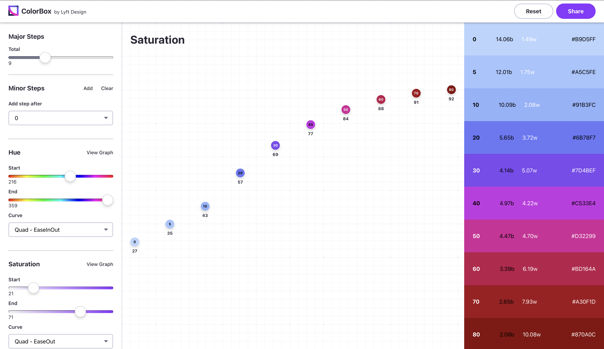

# Michael O'Connor CS4241 Assigment 1

[Glitch Link](https://a1-michaeloconnor1717.glitch.me)

This project shows a simple resume-like website based on my experiences and education. 
The purpose of the site is to demonstrate my ability to use Git, Github, HTML, CSS, basic JS, and Glitch

## Technical Achievements
### CSS Style Rules
Rules were applied to 
- body
- header
- a (hyperlinks)
- footer
- main
- a variety of custom classes

### JavaScript animation
An animation was used to rotate a gif on the Other page 
- press the YES button to view

### HTML Tags
- header
- footer
- main
- iframe
- script
- h1-h5
- p 
- div
- ul
- li
- br

## Design
### Color Palette
Used the [Lyft ColorBox](https://lyft-colorbox.herokuapp.com) site to create a color palette

### Google Fonts
Two Fonts from Google Fonts were used
- [Varela Round](https://fonts.google.com/specimen/Varela+Round?query=varela+round")
- [Roboto](https://fonts.google.com/specimen/Roboto?query=roboto)
